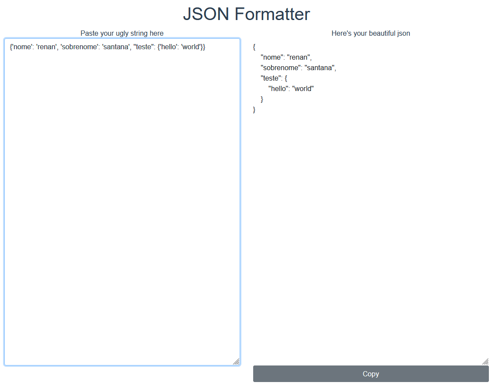

# json-formatter

[](https://app.netlify.com/sites/amazing-json-formatter/deploys)

Um simples app que formata strings JSON em um formato mais legível.

Projeto clone [deste site](https://jsonformatter.curiousconcept.com/), de finalidade semelhante.

Finalizado e hospedado no [Heroku](https://my-json-formatter.herokuapp.com/), e no [Netlify](https://amazing-json-formatter.netlify.app/)



## Project setup
```
npm install
```

### Compiles and hot-reloads for development
```
npm run serve
```

### Compiles and minifies for production
```
npm run build
```

### Lints and fixes files
```
npm run lint
```

### Customize configuration
See [Configuration Reference](https://cli.vuejs.org/config/).
